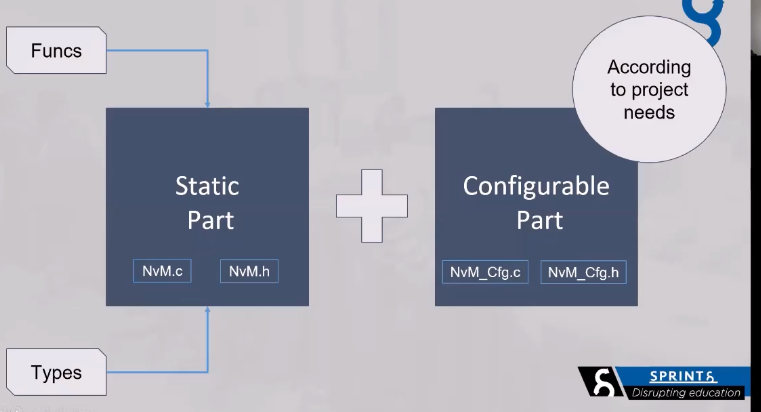
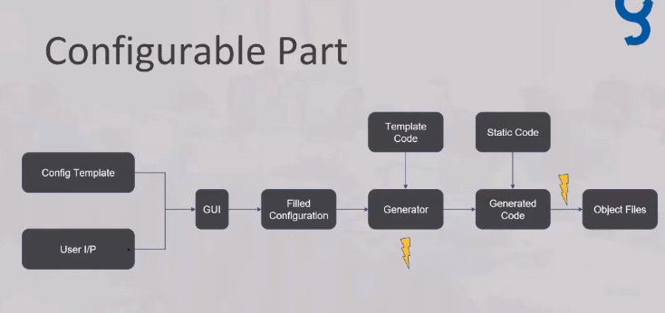
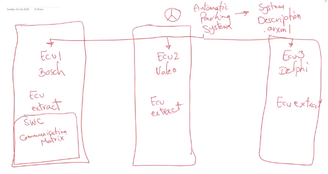
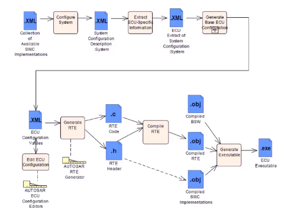

# Autosar Configuration Tools

Any software component is consist of

1. Static Part
2. Dynamic Part

as follows

**_Cfg .c/.h** refers to pre-compile configurations which if modified need the project to recompile such as **#defined** in our code used to configure some features and enable and disable some features in our module which after compilation will generate object files of our c files only

**_Pbcfg .c/.h** refers to post-build-compile which means configuration which can be changed after having an executable such as bootloader applications which is an independent software that can be accessed independently from the main software or a memory saved at certain location that can be accessed from our main code such as internal drivers in tiva-C

**_Lcfg .c/.h** refers to linking configurations which affects code during linking object files or .c files to generate one big executable if modified need the project to be linking again

## Static Part

this part is a plain C code that consists of functions and header files that is going to be implemented to achieve the functionality of a certain module

these documentation can be found in **SWS** document you can look at NVM module SWS document to understand how static part is being writen

## Configurable

**Configuration specification** in SWS descrips these configurations

configuration parameters are clustering into
containers.
It also specifies a template (table) you shall use for the parameter specification.

also **.arxml** file containes our configuration as container tags filled with parameters tags defined by the consortium.

- **config Template** is a plain template xml file not filled with user configurations

- **User Inputs** is the parameters inserted by the user

- **GUI** is a clustering GUI that generates a filled configuration template with user inputs

- **Filled Configurations** is atemplate file **.arxml** that is filled with user configurations

- **Generator** uses Template code to generate a configuration part of our code

- **Template Code** a code without user configuration used as a template for our generator

- **Generated code** a configuration (generated) code filled with configuration is passed into another generator with a static code to generate final .c/.h files to be compiled to generate object files

- **static code** is a static files we created earlier .c/.h files

- **Object files** this is the final object files generated after compilation process is done

## Interoperability of Tools

Tools from different suppliers

usually we need a tool to be interoperable to allow referencing from other suppliers modules that is coded somewhere in our big project

## Autosar SWC Components Descriptions

- each SWC has some needs that are to be met from the RTE

- for the RTE to provide such needs, the application needs to be described for it

- the description can be whether it needs some timing events to be scheduled

- a need to access a function that exists in another Component

- a need to read or write a variable shared with another component

- this is a document with **.arxml** format with other schema different than configuration part .arxml

## Authoring tools and autosar workflows

suppose we as mercedes tier 1 supplier want to develope an automatic parking system over 3 ECUs so we need to define each **.arxml** of the overall system of 3 ECUs

each ECU must have an extract file called ECU extract this file contains **SWC communication matrix** which defines messages sent and received by this ECU with which interfaces

### Autosar Workflow through SW Layers

