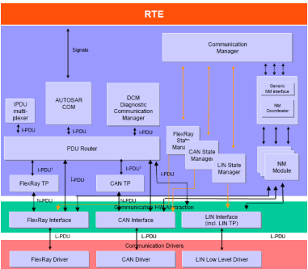
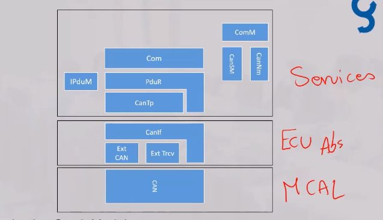
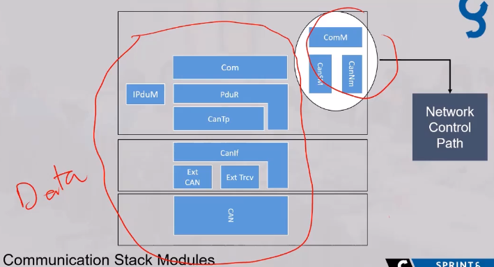
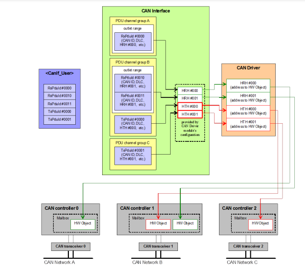

# Communication Stack

according to our project we can choose which module to use and which to throw away so if we use only can we will throw other modules related to other protocols

## Some Core Concepts

each module specifies certain functionality to serve the main stack architecture and for other peripherals we have the same modules but within other modules we specify them according to the scope of our project Requirements

and in this CAN COM Stack we have a network related modules and a data related modules that

## CAN Driver & CAN Transiver (mcal layer)

- Abstract MCU registers
- control of HW transciver,a transcsiver is responsible for voltage regulation of the physical can pins according to ECU
- wakeup and power saving functionalities
- define the HW conrollers or peripherals you will use
- and each controller has a transciver channel
- transciver is a separate hardware controlled by another peripheral whether GPIO or SPI
- physically can has 2-wires (CANH, CANL)

### internal structure of CAN Module

## CAN if (Ecu abstraction layer)

- abstract drivers access for upper layers
- Transmission buffering enable/disable as a feature for a peripheral to save data of a certain mail box accessed (received) by many messages sent previously in code
- Reception indication, which calls upper layers by a function to indicate certain operation
- provides APIs for controller modes
- software filtering
- Data length check
- Define messages to be sent and received, their IDs, upper layer, HW object reference

## CAN TP (Services layer)

- TP(Transport protocol) is responsible for segmentaion of long messages in **TX** and Reassembly of segmented messages in **RX**
- PDU Padding to complete compatiblility with upper layer requirements
- main configs canTp channel, N-SDU(big data collection) and the corresponding N-PDU(small data collections that if merged will form a certain one big SDU) for Tx and Rx , Timing Parameter

## CAN Ipdum (Services layer)

- **PDU layout multiplexing**
  some times we need to send two signals with two different shapes such as one with static part and one with Static and Dynamic parts of
- **multiple PDU to container handling** of multiple PDUs into a container to handle messages between CAN and CAN-FD

## CAN SM (state machine)(Services layer)

- manage the state machine for each CAN controller and transciver, according to requested mode
  - **Full Communication** Send & receive
  - **No Communication** No Send & No Receive
  - **Silent Communication** Receive & No Send
- use many nested State machines to write it's logic that is triggered from app through RTE layer to **ComM** manager

## Com-M (CAN manager)(Services layer)

- Coordinating the availability of the bus communication stack (allow sending & receiving of signals) of multiple independent software components on one ECU
- A user should not have any knowledge about the hardware (eg on which channel to communicate because it is already defined in **Mcal** layer and according to application specs we just just know to which it will communicate and how and what is the messages from ECU extract file which will show us messages on the bus to and from this ECU) A user simply requests a Communication mode

### ComM Features

- controlling of more than one communication bus channel of an ECU by implementing a chennel state machine for every channel
- A SWC can only request FULL_COM and NO_COM, SILENT_COM is internal to the ComM
- in FULL_COM, ComM shall allow transmission and reception on a requested physical the opposite in the NO_COM
- ComM co-ordinates requests from several SWCs that may be on the same physical channel, therfore higher request always wins (FULL COM)
- A Diagnostic request acts as a Full COM request
- Communication limitationsexists to give the application a chance to send valid data even if the channel is available **ComM_CommunicationAllowed()**
- advanced features are related to Network Management

## Can Pdur

- handling transmission from upper modules
- multicast Transmission
- PDU gatewaying
- Complex Driver interaction
- Routing path groups (Ex: Disabling one bus in gatewaying and multicasts)
- config: stating source module and destination module for every PDU

## COM Module

- interfacing with RTE
- packing and unpacking of signals
- communication protection for Rx and Tx (Replicated Pdus)
- Control Transmission modes
- Deadline monitors
- filtering of received signals and Pdus

## COM features

- Transfer Property
  - on signal and signal group level only, TRIGGERED, TRIGGERED ON CHANGE, PENDING
  - Triggered : Causes immediate transmission of the I-PDU, except if periodic transmission is defined for this I-PDU
  - Pending : Doesn't cause the transmission of the I-PDU
- Transmission Mode
  - on I-PDU level
  - Direct (this message is transmitted in the next Main function after trigger event occurred)
  - Periodic (PDU is transmitted cyclically with a specified cycle time)
  - Mixed (A mix between periodic and direct)
  - None (Transmission is triggered by lower layers)

- Transmission mode is selected and then transfer property of the signal and groups signals are selected
- signals unpacking and indication to RTE (Immediate - in Com_RxIndication context, Deferred - in next call to Com_MainFunctionRx)
- Provide minimum Delay Timers for each PDU (Minimum time between transmissions for each PDU, in configured)
- if transmission is requested before MDT ends , new request is postponed until delay time expired
- Reception Deadline Monitoring to make sure periodic received PDUs are within the allowed time frame
- Transmission Deadline Monitoring : used to make sure the PDUsis acknowledged on the bus by a receiver (Tx Confirmation) within allowed time
- in case reception DM is configured for signalswith update bits, COM shall perform a separate monitoring for each signal/signal group with an update bit
- if different ComTimeout parameters of the associated signals/signal groups of an I-PDU are configured, the Autosar COM module shall use the smallest value as timeout parameter for the transmission deadline monitoring of the I-PDU
