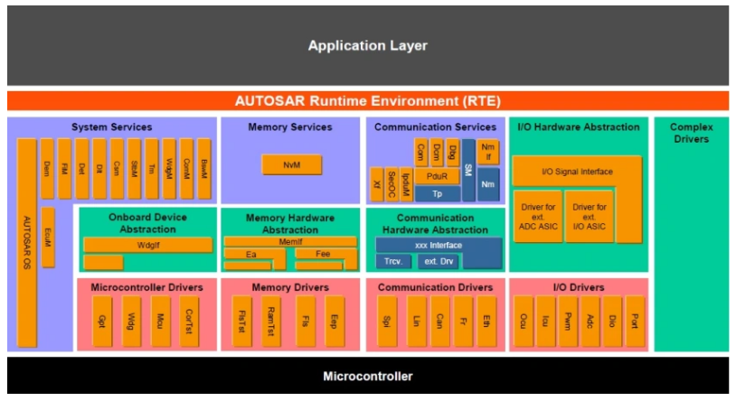
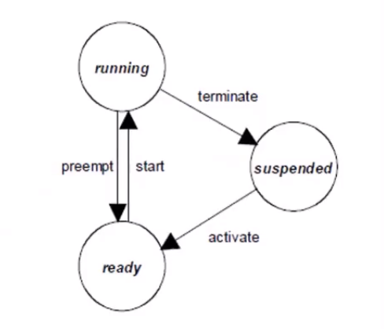
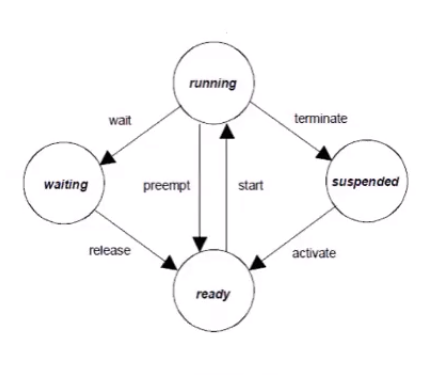
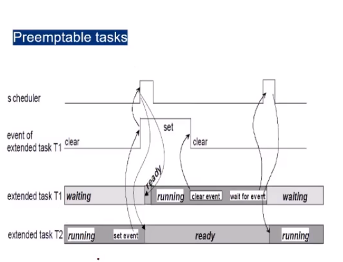
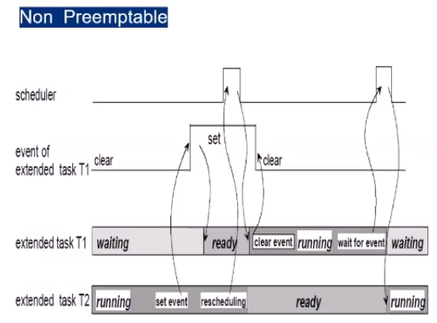
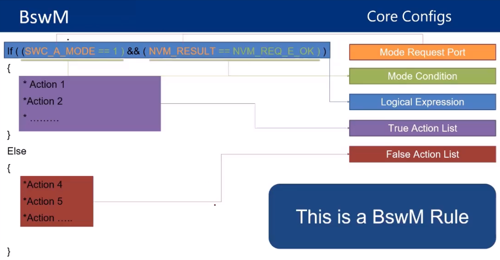
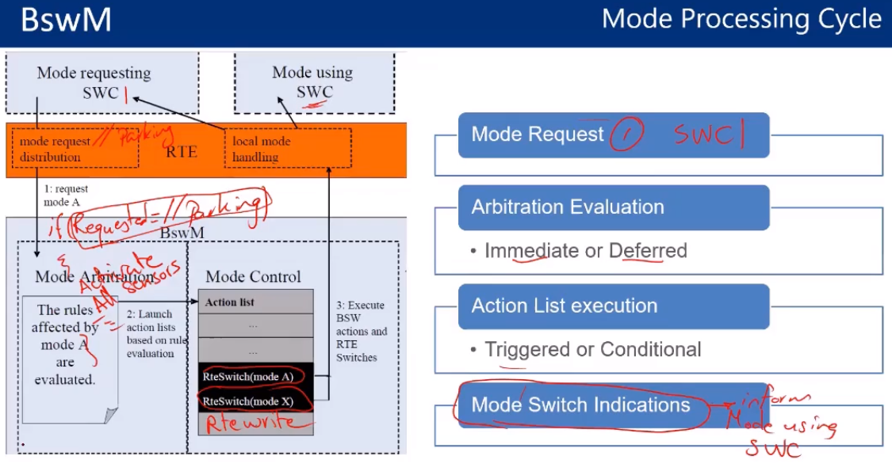

# System Services and OS Stack

here we will talk about system services specially **BswM, ComM, ECUM, Autosar OS**  and will include **Gpt, Mcu**

## Autosar OS

- autosar have a certain object which if linked together can produce the complete behavior of OS According to **OSEK standard** these modules are
  - **Counters**
    - Could be SW or HW
    - at least one counter needs to be defined
    - values measured by ticks
    - main timing entity for the OSs
  - **Tasks**
    - parts of the complex components broken into functions
    - Parts are executed according to their real time requirements
    - A task defines the **framework**(stack size, priority, resources) for these parts to execute
    - scheduler determines the sequence of the task execution
    - Task Types
      - **Basic Task**
        - 
        - relases the processor only when they terminate
        - after termination the os switches to a higher priority task or an interrupt service routine
      - **Extended Task**
        - 
        - extended tasks are distinguished from basic tasks by being allowed to use the operating system call **WaitEvent** which may result in a waiting state
        - the waiting state allows the processor to release and to be reassigned to a lower-priority task without the need to terminate the running extended task
  - **Resources**
    - used to co-ordinate concurrent accesses of several tasks or interrupts with different priorities to shared resources, such as memory areas or hardware
    - a task only runs if all needed resources have been released
    - and task can't be completed with a resource occupied
  - **Event**
    - a mean of synchronization
    - is only provided for extended tasks
    - initiates state transitions of tasks to and from the waiting state
    - cleared by OS
    - eg. signaling of a timer expiration, availability of a resource, reception of a message
    - Preemptive Task
      - 
    - Non-Preemptive Task
      - 
  - **ISR**
    - in autosar it is divided in two categories
      - **ISR category 1**
        - the ISR does not use an operating system service
        - after the ISR is finished, processing continues exactly at the instruction where the interrupt has occuredm i.e the interrupt has no influence on task Management
        - the ISRs fo this category have the least overhead
      - **ISR category 2**
        - the OSEK operating system provides an ISR-frame to prepare a run-time eviroment for a dedicated user routine during system generation the user routine is assigned to the interrupt
        - rescheduling takesplace on termination of the ISR category 2 if a preemptable task has been interrupted and if no other interrupt is activate
  - **Alarms**
    - an alarm triggers an action
    - action : starting a task, invoke a callback, set Event, increment a counter
    - an alarm will expire when a predefined counter value is reached
    - can be single or cyclic
  - **Schedul Table**
    - not provided by **OSEK** another method of scheduling tasks within the OS
    - simpler to configure
    - repeats over time

also autosar defined some extra functionalities to be more configurable

## ECUM

Dependencies to other Modules

  1. MCU and rest of MCAL drivers
     - \<Driver\>_init Apis are called,system developer must consider order of initialization in the ECUM initialization lists
  2. peripherals with wakeup capabilities
     - peripheral must call EcuM_SetWakeupEvent upon detection of a wakeup event
  3. OS
     - EcuM starts the OS and handles all operations before that also it is responsible to shutdown the OS and how control is handled after that
  4. Schm and **BswM**
     - starts the scheduler of the Ecu and delegates control of generic mode management to the BswM module until shutdown occurs

now let's talk about EcuM core configs

- EcuM Driver init Lists
  - list Zero : Usually Det(Development Error Tracer(smallest module in autosar removed before production)), Dem_PreInit
  - list One : Rest of MCAL Drivers
- wakeup source : CAN, ICU, ..
- Define sleep modes if any
  - map to MCU sleep modes of different power options
- Reset Modes : MCU,WDG, etc..
- Integration Code implementations, Ex:
  - EcuM_StartupTwo

## BswM (Basic software manager)

let's talk about core configs for BswM a simple configuration can be done by knowing names of parts to be configured it simple but must be known for configuration process

also we can control the mode of our module as a state transition cycle such that

## Mcu

- initialize CPU clocks and PLL
- Microcontroller software reset
- Define MC modes
- Configure peripheral Clocks
- MCAL Layer

## Gpt (General Purpose Timer)

- provides exact short term timings
- hardware Based
- Config : Define channels for timers and their values
- In MCAL Layer
