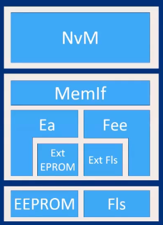
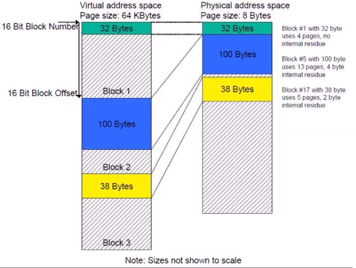
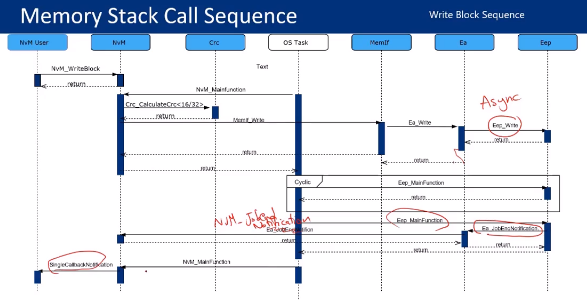

# Memory Stack

- provide non volatile data to the application in a uniform way
- provide mechanisms for non volatile data management like saving, loading, checksum protection and verification, reliable storage etc
- abstract from memory locations and properties

memory technology :
**Flash** : cheap, sector erasable, Faster Write cycles,Slower Erase Cycles
**EEPROM** : Expensive, Byte Erasable,Slower Write cycles, Faster Erase Cycles

Memory Stack Architecture

- Memory block types
  - RAM
  - ROM
  - Nv Data
    - Native            physically have one Data block size
    - Redundant         physically have two copies of single Data block size
    - Dataset           physically have 1 to M Data block size
  - Admin

Stack Modules

## NVM (Services Layer)

### main features

- provides reading and writing services to the application
- Handles concurrent accesses from all application components
- performs CRC checks

### core configurations

- Memory Block Number
- ROM Address(Optional)
- RAM Address(Optional)
- Selection for WriteAll/ReadAll
- CRC Type
- Block Management type (native, Redundant,dataset)

## Memif (ECU layer)

- abstraction of the services layer from the type of memory technology used, acts as a router to Flash or EEPROM

## EA/FEE

### Main Features

- abstracts from the device specific addressing scheme and segmentation
- Provide mapping between virtual and physical Addresses
- Virtual address space of 32bit
- 16bit : a theoretical number of 2^16 of blocks
- 16bit : a theoretical block size of 64Kbyte per block

### FEE have extra feature

- the FEE module emulates the same behavior of using EEPROM although physically they are different memory technologies, especially for erasing scheme

- flash erase scheme is by sector, yet in EEPROM it is by byte blocks

### Virtual to physical Mapping

you can implement it the way you want because autosar didn't define a way to implement it

### Core Configs

- memory block satisfying the NVM NV Block types
- Ex: Redundant NVM Blocks will result in configuring 2 Fee Blocks
- For each Block, Size configured = Data Size in NVM + Added CRC size configured in NVM

in the FEE we need to configure **Native** and **Redundant Data Blocks**

## EEP/FIs

- Abstraction of microcontroller registers
- provide services for reading, writing and Erasing fromthe physical memory
- **Main configurations** would be sctor size, page size and number of sectors(obtained from MC spec sheet)

